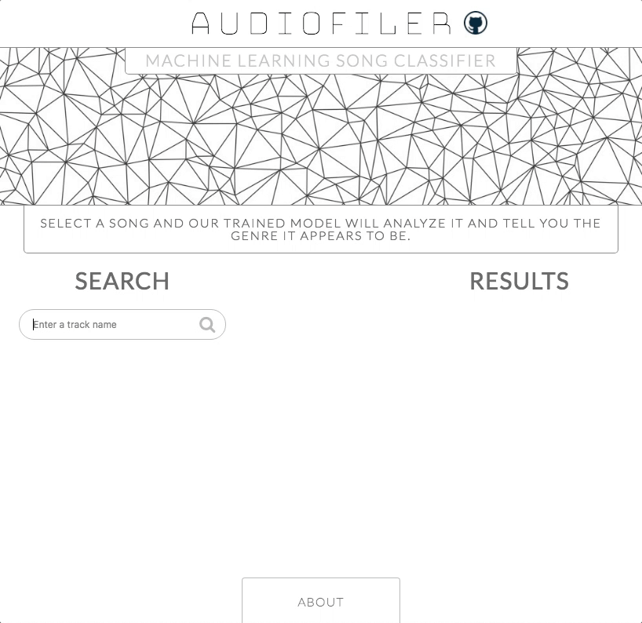
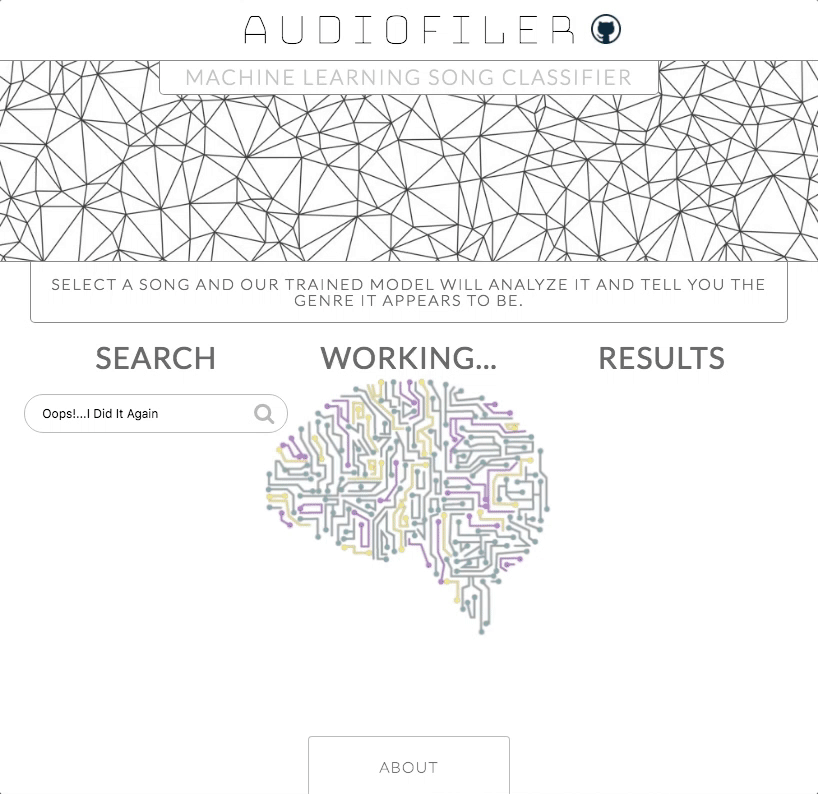

# AudioFiler - **Machine Learning Song Classifier**

## Overview

AudioFiler takes a song of your choice and uses machine learning to guess its genre. Our program extracts a series of audio features from the song and passes them into 20 separately trained computer models, each of which decides the category it thinks the song belongs in. We then return the complete results and

## How it works

Using the Spotify API, we allow users to do fuzzy searches on track names in order to select the song they want to analyze.

Then, a link to a 30-second preview of the song is passed to our backend, where it is downloaded and run through our audio extraction module built with pyAudioAnalysis.

After its audio features have been extracted, these features are passed into twenty different instances of our trained random forest classifier. Each of these models returns it's best guess, and the twenty guesses are combined and returned to the frontend.

### Features and Technologies:
* Frontend
  - **ReactJS/Redux**
* Fuzzy search
  - **Spotify API**, React-Autosuggest
* Audio feature extraction
  - **[pyAudioAnalysis](https://github.com/tyiannak/pyAudioAnalysis)**
* Machine learning genre classification
  - **[SkLearn](http://scikit-learn.org/stable/)** random forest classifier
  - **[TensorFlow](https://www.tensorflow.org/)*** artificial neural networks
* Database
  - Original data from **[Million Song Dataset](https://labrosa.ee.columbia.edu/millionsong/)**
  - **SQLite3**, python scripts for cleaning and compiling
* Backend
  - **Python2**, **Python3**
  - Two separate **Django** servers

## Demonstration

## Compiling the dataset
Our data was compiled using the Million Song Dataset, which consists of song titles and user-generated genres from the Last.fm.

We selected 26 of the top genre tags and used python scripts to build our own, cleaner database, mapping similar genres and alternate spellings to ensure consistency.

We further cleaned our dataset by querying Spotify for each track name, removing songs that did not exist. For songs that existed, we inserted 30-second preview URLs into our database.

After our dataset was cleaned, we used other python scripts to batch download MP3s which were stored in folders for audio processing.

Text files containing all of the audio features for the entire dataset were generated using our feature extraction module. Corresponding text files containing the genres were also generated for training the models.

## Training the model
Our models were trained with 45,000 songs, each consisting of a 70-dimensional vector of audio features.

The 70 audio features were extracted using the pyAudioAnalysis library and include such features as BPM, Zero-Crossing, MFCC co-efficients, and Root-Mean-Squared Energy.

First, we built an Artificial Neural Network using the TensorFlow library. We implemented 3 hidden layers of RELU neurons. This model suffered from overfitting, possibly due to the large number of Rock songs in our dataset.

The current version of the application utilizes Random Forest Classifiers to determine genre. These models tend to deal better with overfitting.

## Querying the model
As the user types a search query into our search field, we query the Spotify API for matching track names on each change, and responsively populate a dropdown list from which the user can select the track they intended.

When the user selects their desired track, we send the associated preview URL to our python3 Django backend which passes it along to our python2 backend for audio feature extraction.

In our python2 backend, the song is downloaded and analyzed, and the resulting vector is returned to our python3 server. Here, it is passed into 20 trained instances of our Random Forest Classifier. Each of these decides the genre of the song, and the results are compiled by dividing genre count by twenty. An array of these results is returned to the frontend and displayed for the user.

## Server setup
Determining how to deploy our application presented challenges.

Because our site needed to implement libraries in both python2 and python3, we decided that running two separate servers would be a simple, effective way to deploy our application.

Common sites like Heroku are not set up to host scientific projects that implement sciPy, so we had to research other platforms that would allow us to run the libraries we required. PythonAnywhere provided a good alternative, and we were able to successfully configure our project to run on this service.

## Future Directions

- [ ] Visualizations showing the training process
- [ ] Visualizations of the audio feature extraction
- [ ] User evaluations are incorporated into the dataset and used to improve the model
- [ ] Suggest similar tracks
- [ ] Modify model to produce untrained clusters
- [ ] Utilize a combination of ANN and RFC to improve accuracy

\* TensorFlow, the TensorFlow logo and any related marks are trademarks of Google Inc.
